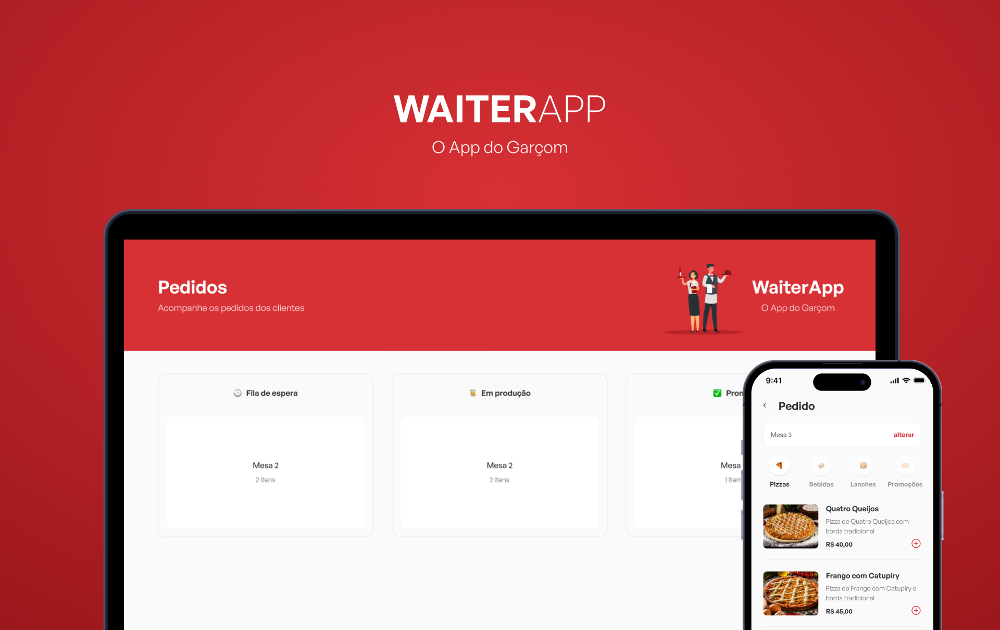

<h1 align="center">
  
</h1>

<p align="center">
  Client for an app to help waiters to create and manage orders in a restaurant
</p>

## Project

<h1 align="center">
  
</h1>

## Technologies used

This app uses several things, such as:

- ReactJS
- Styled-components
- Typescript
- Vite

## How to recreate the application?

### Prerequisites

To run the app make sure you have the following tools: [Git](https://git-scm.com), [Node.js](https://nodejs.org/en/).

### Running the app

Clone this repository

```
git clone <repository link>
```

install the dependencies

```
yarn install
```

or

```
npm install
```

Run in developer

```
yarn start
```

The application will run on: [localhost](http://localhost:5173/)
